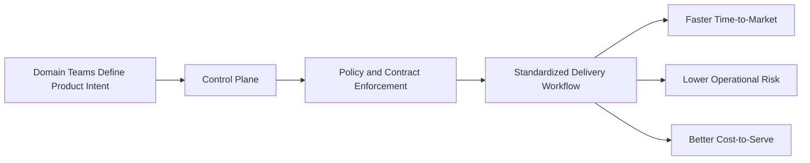

# Why Data Mesh Needs a Control Plane

> Published: 2026-03-01

## Executive Summary

Data Mesh provides a strong organizational principle, but principles alone do not produce predictable business outcomes.
A Control Plane turns domain ownership, governance, and data contracts into an operating system that scales with the business.

Without a Control Plane, Data Mesh initiatives often stall in documentation and fragmented tooling.
With a Control Plane, organizations improve delivery speed, reduce policy risk, and lower the cost of scaling data products.

## Business Problems Data Mesh Alone Does Not Solve

Even with domain-aligned teams, companies still face structural problems:

- inconsistent product quality across domains
- repeated compliance effort on every release
- long cycle times caused by manual coordination
- poor visibility into ownership and accountability
- growing platform cost as complexity increases

Data Mesh clarifies "who owns what". It does not automatically enforce "how products are delivered".

## Why a Control Plane Changes Unit Economics

A Control Plane standardizes the path from product intent to production.
That directly improves unit economics for every data product:

- lower onboarding cost for new domains
- less rework from late governance findings
- fewer production incidents tied to contract drift
- shorter lead time from concept to usable product

When each new product is cheaper and faster to launch, portfolio-level ROI improves.

## Risk, Compliance, and Change Management

Risk increases when governance is external to delivery.
A Control Plane embeds policy checks, contract validation, and lifecycle controls in the release flow.

This creates measurable advantages:

- compliance moves from ticket-based to policy-based
- breaking changes are detected before downstream impact
- auditability improves through consistent lifecycle events

## Operating Model for Domain Autonomy with Guardrails

The right target model is not central control or full decentralization.
It is domain autonomy with shared guardrails.

A Control Plane supports this by separating responsibilities:

- domains own product intent and outcomes
- platform teams own reusable control mechanisms
- governance defines policies once and applies them everywhere

## KPI Framework

To evaluate business impact, track a small KPI set consistently:

- lead time from request to active data product
- policy exception rate per release
- incident rate related to schema or contract changes
- reuse ratio of shared product components
- cost-to-serve per active data product

These metrics connect platform decisions to financial and operational outcomes.

## Takeaways

Data Mesh defines a direction. A Control Plane makes that direction executable.
For organizations that want scale without chaos, the Control Plane is the mechanism that converts data strategy into business performance.
