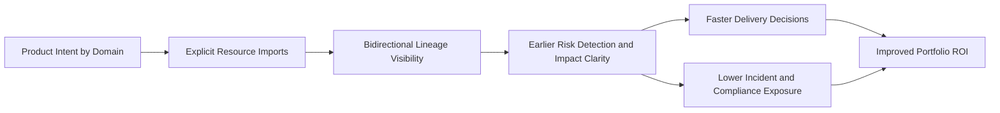

# Lineage as a Business Control System

> Published: 2026-03-03

## Executive Summary

Most organizations treat lineage as a technical visualization. That is too narrow. Dependency visibility is a business capability because it determines how confidently leaders can approve planResource, allocate capital, and absorb risk across domains.

When lineage is explicit and governed, delivery decisions stop relying on assumptions. In CataMesh, the core model makes cross-product dependencies visible through declared imports and bidirectional lineage. That clarity lowers uncertainty in planning, reduces the cost of planResource, and improves portfolio-level outcomes.

## The Cost of Dependency Blindness

When dependency relationships are implicit, the business pays in multiple ways:

- delayed releases while teams manually discover downstream impact
- hidden blast radius from producer changes that break consumers unexpectedly
- compliance exposure when planResource approvals happen without full dependency context
- duplicated spend as domains rebuild similar capabilities instead of reusing existing resources
- inflated contingency budgets due to low confidence in delivery predictability
- slower strategic pivots because teams cannot safely reprioritize connected products

Dependency blindness is not a tooling inconvenience. It is an operating model tax that compounds as the product portfolio grows.

## What the CataMesh Core Model Makes Explicit

The core-api model is important because it turns ambiguous coordination into explicit commitments that leadership can govern.

First, Data Products are represented as governed operating units, not just project artifacts. Each product carries intent, ownership context, and operational status across environments. That gives executives a stable unit for investment, accountability, and performance tracking.

Second, resource imports formalize cross-domain consumption. Instead of informal agreements, teams declare which resource from another product they depend on. This is a business contract: it defines where value is reused, where risk is inherited, and where coordination must be intentional.

Third, bidirectional lineage makes impact analysis symmetrical. Upstream lineage shows where a product depends on others. Downstream lineage shows who depends on it. Together, this becomes a decision map for release governance, incident containment, and roadmap prioritization.

Finally, the desired-versus-observed posture provides a business signal for reliability. Desired intent captures what the organization expects to run. Observed state reflects what is actually running in each environment. The delta between both is not only a technical drift indicator; it is an exposure indicator for service quality and operational risk.

## Business Outcomes Enabled

### Faster planResource approvals

Leadership approvals accelerate when impact analysis is evidence-based. With explicit imports and lineage, governance and risk teams can evaluate affected consumers quickly, rather than requesting ad hoc dependency mapping from multiple teams.

### Lower incident impact

When incidents occur, response quality depends on knowing who is affected. Bidirectional lineage reduces mean time to identify impacted products, allowing business continuity decisions to be made earlier and with better confidence.

### Better investment prioritization

Not all products have equal leverage. Products with high downstream usage often deliver disproportionate business value and risk concentration. Lineage visibility helps leaders prioritize funding, hardening, and roadmap sequencing based on portfolio impact, not local team urgency.

### Stronger accountability between domains

Declared imports establish transparent dependency contracts between producer and consumer domains. This reduces ambiguous ownership during planResource windows and creates a clearer basis for shared service levels, escalation rules, and planning commitments.

## KPI Framework for Leadership

To turn lineage into measurable business value, track a compact KPI set at portfolio level:

- dependency impact assessment lead time
- planResource failure rate for dependency-linked releases
- mean time to identify affected consumers
- drift-related incident rate
- reuse ratio of imported resources
- cost-to-serve per connected data product
- percentage of releases with complete dependency declaration
- high-criticality products with tested dependency rollback paths

These KPIs help leaders connect operating discipline with financial outcomes. The goal is not reporting for its own sake; it is to reduce uncertainty, improve throughput, and protect customer-facing reliability.

## Operating Model Implications

A dependency-aware control system clarifies how autonomy and guardrails coexist:

- domain teams own product intent, dependency contracts, and product-level outcomes
- platform teams own control mechanisms, observability baselines, and reconciliation capability
- governance teams define enterprise guardrails, risk thresholds, and policy expectations

This split is critical. Without it, either control becomes centralized and slow, or autonomy becomes fragmented and risky. Lineage-backed governance enables decentralized execution with centralized visibility.

## 90-Day Adoption Path

### Days 0-30: Establish visibility baseline

- define the executive KPI baseline for dependency-aware delivery
- require dependency declaration for new or materially changed products
- identify the top 10 products by downstream business criticality

**Business milestone:** leadership can identify high-impact dependency chains without manual investigation.

### Days 31-60: Embed governance into delivery

- include dependency impact checks in planResource approval workflows
- set escalation paths for producer changes affecting critical consumers
- start monthly portfolio reviews using lineage-informed risk indicators

**Business milestone:** release approvals move from opinion-based to evidence-based for connected products.

### Days 61-90: Optimize economics and resilience

- prioritize investment in high-leverage shared products
- define risk-adjusted rollout policies for heavily connected domains
- tie operational funding decisions to dependency-aware performance metrics

**Business milestone:** dependency-informed decisions are reflected in roadmap sequencing and budget allocation.

## Takeaways

Lineage reduces uncertainty premium in delivery. When decision-makers can see dependency implications early, they spend less time buffering for unknowns and more time shipping value with confidence.

Dependency-aware control improves portfolio economics. Explicit imports, bidirectional lineage, and desired-versus-observed visibility create a more predictable operating system for growth, risk control, and return on platform investment.
