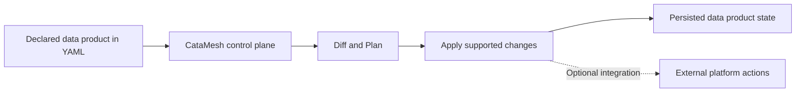

# What CataMesh Is Building, and What It Is Not

> Published: 2026-03-15

## Executive Summary

CataMesh is not trying to be another data engine, scheduler, or general-purpose orchestration layer.
It is building a control plane for data products: a system that makes product intent explicit, compares desired state with current state, and turns change into a controlled workflow.

That focus matters.
Most organizations do not need one more platform that duplicates execution technologies.
They need a way to define, review, and evolve data products consistently across domains.

## The Problem Worth Solving

Data Mesh often struggles not because domains lack autonomy, but because product change remains ambiguous and manual.

Common problems appear quickly:

- product definitions live in documents, tickets, and tribal knowledge
- platform changes are hard to review before execution
- governance arrives late, after delivery decisions are already underway
- teams cannot easily tell whether declared intent matches stored reality

Without a control plane, every product change becomes a local coordination exercise.
That does not scale well.

## What CataMesh Is Building

CataMesh is building a declarative model for data products.

Today, that means:

- data products are defined in YAML with metadata, spec, resources, and resource definitions
- the control plane can validate that declaration and compare it with current stored state
- `diff` and `plan` make change explicit before execution
- `apply` persists supported create operations for data products, resources, and resource definitions
- the current stored definition can be retrieved back from the control plane

This is a deliberate scope.
The goal is to make data product intent operable before expanding into broader platform concerns.

## What CataMesh Is Not

CataMesh is not the warehouse, stream processor, or scheduler itself.

It is not trying to replace execution engines.
It is not promising that every update or delete operation is already automated in the current implementation.
It is not a central platform taking ownership away from domains.
It is not useful if product intent stays implicit and unmanaged.

Those boundaries are a strength, not a weakness.
They keep the product focused on the control-plane problem instead of turning it into another sprawling infrastructure layer.

## Why This Scope Discipline Matters

Platform sprawl usually starts with good intentions.
A tool begins by solving one coordination problem, then gradually absorbs unrelated concerns until it becomes difficult to reason about, difficult to govern, and expensive to extend.

CataMesh should avoid that trap.

When a control plane stays focused on explicit intent and controlled change, it creates a stable base for:

- clearer ownership across domains
- more reviewable product change
- better governance insertion points
- safer future integrations with execution platforms

This is how a product becomes extensible without becoming vague.

## How to Judge Progress

Progress should not be measured only by the number of integrations or supported runtimes.

A better test is whether teams can:

- declare a data product clearly
- inspect the delta before change
- apply supported changes safely
- recover the current stored definition
- extend the model without losing consistency

If those capabilities improve, the control plane is becoming more useful.

## Takeaways

CataMesh is building the layer that makes data product intent explicit and operable.

The objective is not to own every part of the data platform.
The objective is to make data products reviewable, governable, and changeable through a control plane that can grow deliberately over time.
