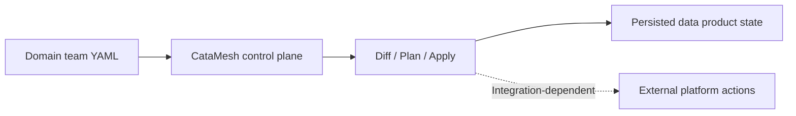
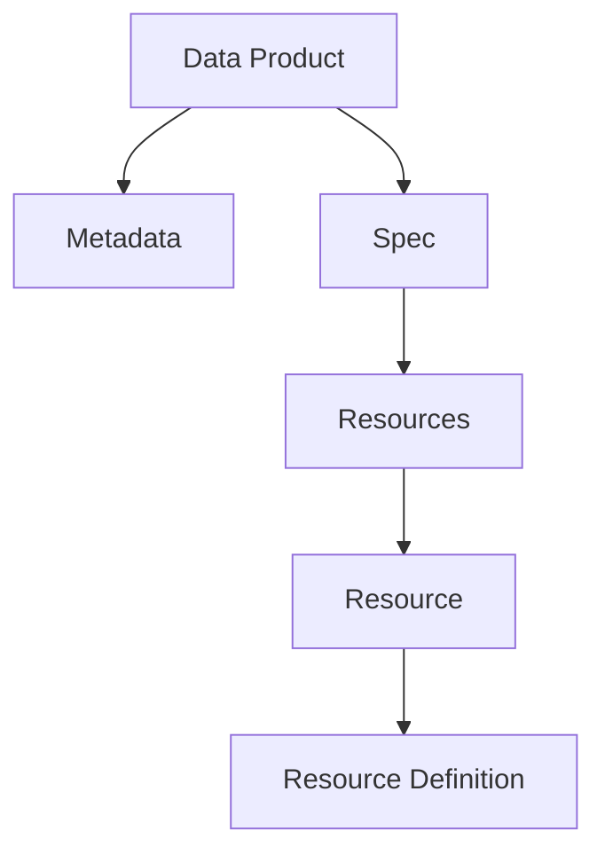
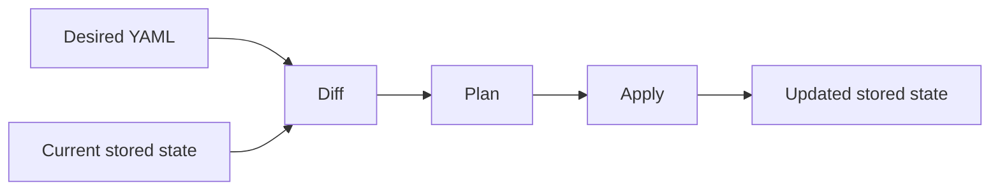

# What is CataMesh? — Architecture

**CataMesh is a control plane for data products.**

Teams describe the desired state of a data product in YAML. CataMesh reads that declaration, compares it with the current state stored in the control plane, and produces a controlled `diff -> plan -> apply` workflow.

This page explains the architecture at a high level without assuming deep knowledge of the codebase.

## What CataMesh Is

CataMesh treats a data product as a versioned, declarative artifact instead of a collection of manual platform changes.

In the current product, the control plane is centered on storing and reconciling data product state. It is the place where metadata, spec, resources, and resource definitions are compared and persisted. External platform provisioning can be connected to this model, but that is an integration concern rather than the main behavior shown by the current core.

## How a Data Product Is Modeled

A data product in CataMesh is declared in YAML with a small, explicit structure:

* `metadata` identifies the product and its domain
* `spec` describes the product type and its resources
* each `resource` has a `kind`
* each resource points to a `resource definition`

The current repository models data products conservatively. The implemented examples are currently centered on `source-aligned` data products, resources such as `bucket` and `flink`, and a built-in `bucket/v1` resource definition schema.

This separation matters because CataMesh can track the product-level declaration independently from the resource-specific definition attached to each resource.

## How Changes Flow Through CataMesh

The core workflow is simple:

* `diff` compares desired YAML with the current stored state
* `plan` turns that delta into explicit steps
* `apply` executes the supported steps and persists the resulting state

This makes changes reviewable before execution and keeps the current state visible to the control plane.

In the current implementation, `apply` fully supports creation flows for data products, resources, and resource definitions. Updates and deletes can appear in `diff` and `plan`, but they are not yet fully executed by the current apply pipeline.

## What the Control Plane Persists Today

Today, the control plane behavior is primarily persistence and reconciliation oriented.

It stores the declared structure of a data product and the related resources that belong to it. In practice, that means CataMesh can:

* read a declared data product from YAML
* validate its structure
* compare it with the stored version
* produce a plan of changes
* persist supported create operations
* retrieve the current stored data product state

This is why it is more accurate to describe CataMesh as a control plane for data product state than as a broad end-to-end data platform orchestrator.

## Why This Architecture Matters

This architecture gives teams a predictable way to evolve data products.

Instead of relying on ad hoc changes, they work from a declared desired state, inspect the difference against current state, and apply supported changes through a consistent workflow. That makes the model easier to understand, easier to review, and easier to extend over time.

For a new reader, the key idea is simple: CataMesh keeps data product intent explicit, compares that intent with what is currently stored, and uses that gap to drive controlled change.
